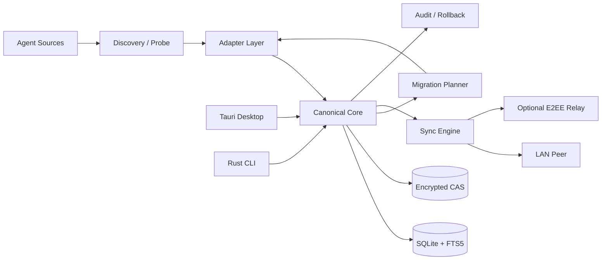
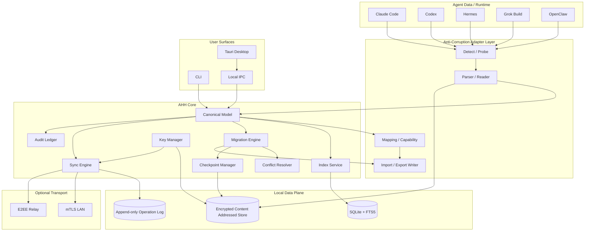
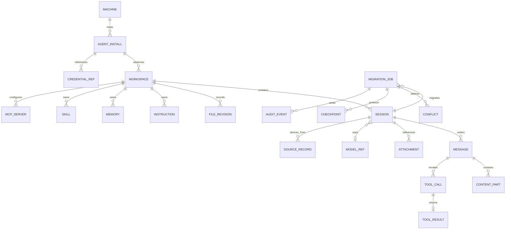
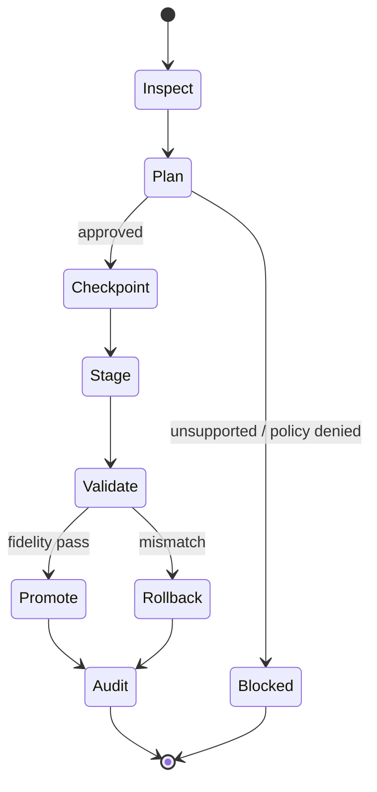
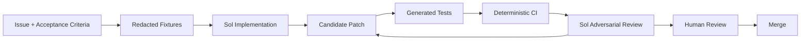

# Agent History Hub：跨 Agent 会话与项目历史管理平台研究、Project Plan 与 Specification

## 执行摘要

## 当前实现增量（AgentArk 0.5.0）

在保留本规划书 L0/L1/L2 分层合同的前提下，当前桌面迁移页已加入 Codex
原生 payload 恢复路径：导出 Codex 时把源 `CODEX_HOME/sessions` 中与已索引
会话匹配的 rollout JSONL 脱敏后放入 `.ahbundle`；目标恢复时检查 Codex
版本和运行状态，原子写入目标 `CODEX_HOME`，用 App Server 重新列出/读取
thread，失败则回滚本次新增文件。Codex 以外的 Agent 仍保持 AgentArk 索引
和语义迁移边界，不伪造供应商原生会话。Codex 原生恢复完成后需要重启 Codex
客户端刷新会话列表。

本项目建议暂定名为 **Agent History Hub（AHH）**：一个面向 Claude Code、Codex、Hermes、Grok Build、OpenClaw 的 **local-first、跨平台、可审计的 Agent 会话与项目历史管理层**。其核心价值不是再做一个聊天客户端，而是建立一个位于各 Agent 之上的“**Agent 数据控制平面**”：自动发现本机 Agent 与工作区，持续索引会话、消息、工具调用、附件、文件快照、instructions/memory/skills/MCP 等资源，在统一 UI/CLI 中查询，并通过统一中间模型实现 Agent 间、设备间和 Windows/Linux/macOS 间迁移。

这一路线具有现实可行性，但必须重新严格定义“**无缝迁移**”。各产品没有共同的原生 session persistence 标准；例如 Claude Code 官方确认本地 transcript 位于 `~/.claude/projects/`，默认只保留 30 天，并且 CLI 与 Desktop 各自维护 session history；CLI 会话可通过官方 `/desktop` 转到 Desktop，但 Anthropic 没有为第三方提供“任意写入 Claude 原生历史”的公共契约。citeturn13search0turn13search9 Codex 则提供了明显更适合作为集成边界的 App Server：其 JSON-RPC thread API 能列出、归档、恢复、删除、修改 metadata，并明确操作磁盘上的持久化 JSONL thread log。citeturn14search1 Hermes 的持久化契约最透明之一，官方直接记录 `~/.hermes/state.db`、SQLite WAL、sessions/messages/FTS5 等结构，并已经提供 session REST API。citeturn15search0turn15search4turn15search23 Grok Build 会把 prompts、responses、tool calls 和 file snapshots 自动保存在 `~/.grok/sessions/`，同时提供 resume/fork/export/import 与 ACP JSON-RPC。citeturn17search6turn17search2turn16search0 OpenClaw 当前则明确采用全局 SQLite + 每 Agent SQLite，并要求客户端通过 Gateway 查询和控制 session。citeturn18search0turn18search18

因此建议把迁移能力定义成四个层级，而不是声称所有供应商都可以做到 bit-for-bit 的原生 session 注入：

| 级别 | 定义 | 产品承诺 |
|---|---|---|
| **L0 Exact Archive** | 原始记录、可见消息、文件、附件、来源 metadata 和 hash 被完整归档 | 所有受支持 Agent 必须达到 |
| **L1 Semantic Migration** | 在目标 Agent 中可继续工作；可见对话顺序、项目文件、instructions、附件和公开上下文保持 | 所有 5×5 路径必须达到 |
| **L2 Native Resume** | 目标 Agent 能用自己的原生 session/thread ID 继续 | 仅目标提供官方/可验证接口时承诺 |
| **L3 Environment Migration** | memory、skills、MCP、公开权限规则、agent profile 等环境一起迁移 | capability-driven，尽可能支持 |

**这是本项目最重要的产品合同。** AHH 不应通过直接修改供应商私有 SQLite/JSONL 来伪造“原生会话”。对于目标不提供 import/create-session 契约的情况，应创建 **Semantic Handoff Session**：新建目标会话，注入规范化上下文、项目状态与 provenance，并明确标记为 L1，而不是假装 L2。

技术上建议采用：

**Rust Core + Tauri 2 + React/TypeScript + Rust CLI + SQLite/FTS5 + 加密内容寻址对象库（CAS）+ Adapter anti-corruption layer**。

Tauri 官方当前支持 Windows、Linux 和 macOS，Updater 也覆盖三类桌面平台；其发布工具链可以在 CI 中构建 Windows、Linux 与 macOS 多架构产物，因此比“Electron UI + 单独 native daemon + 单独 CLI”更容易复用同一 Rust 核心。citeturn19search0turn19search4turn19search8 SQLite 官方提供 WAL、FTS5 和 Online Backup API，适合作为本地 metadata/search store；尤其读取正在运行的 Hermes/OpenClaw/Codex SQLite 时，应使用一致性只读事务或 backup API，而不能简单复制一个 `.db` 文件后忽略 WAL。citeturn19search9turn19search29

项目建议周期 **32 周**：2 周 Discovery + 10 个 3 周 Sprint。建议平均约 **5.5–6.5 FTE**，总量约 **45–52 FTE-month**。按立项预算假设 USD 12k–25k / FTE-month 计算，工程成本约 **USD 0.54M–1.30M**；这是项目预算参数，不是地区薪资市场报价。

已生成两份可直接纳入代码仓库的 Markdown 启动文档：

[下载 Project Plan](sandbox:/mnt/data/agent-history-hub-plan.md)

[下载 Specification](sandbox:/mnt/data/agent-history-hub-spec.md)

## Project Plan

### 目标、范围、交付物与敏捷路线图

产品首先应被定位为 **“Agent History/Data Interoperability Layer”**，而不是聊天历史聚合器。只做“展示会话”很容易，但真正形成壁垒的是：**provenance-aware indexing + canonical model + capability-aware migration + verification + audit + rollback**。

核心目标与 Definition of Done 建议如下：

| 目标 | 必须交付 | 验收标准 | 优先级 | 目标里程碑 |
|---|---|---|---|---|
| 自动发现与索引 | Agent detector、版本探针、路径 discovery、增量 watcher、reconciliation scanner | 五类 Agent 在三系统自动识别；自定义 home/path 可覆盖；源文件不被修改；增量变更 p95 ≤ 2s | P0 | M1 |
| 统一浏览与搜索 | Session timeline、tool trace、附件、workspace explorer、FTS、CLI `list/show/search` | 支持字段无静默丢失；10k-message session 首屏 ≤ 500ms；全文检索 p95 ≤ 150ms | P0 | M1 |
| 全 Agent 迁移 | Canonical model、5 adapters、Migration Planner、loss report、import executor | 5×5 共 25 条路径均能 dry-run；支持字段完整性 100%；不支持字段显式报告 | P0/P1 | M3 |
| 跨设备/跨 OS | `.ahbundle`、backup/restore、LAN transfer | Windows↔macOS↔Linux 可恢复；文件/附件 SHA-256 完全一致；中断可续传 | P1 | M2/M4 |
| 安全与权限 | OS keychain、encryption、least privilege、RBAC capability、secret scanner | 默认不保存 OAuth/token value；云不开启则没有正文外发；敏感写操作必须授权 | P0 | M1→GA |
| 版本与冲突 | Schema SemVer、adapter compatibility matrix、HLC/op-log、3-way merge | 不允许会话正文 LWW 覆盖；二进制冲突保留双份；未知 schema fail-closed | P1 | M4 |
| 审计与回滚 | dry-run、checkpoint、staging、verification、hash-chain audit | 每个写操作有 before/after hash；故障注入后能恢复 checkpoint | P0/P1 | M4 |
| 发布运维 | installers、signed updates、backup、doctor、compat diagnostics | 三平台安装升级可回滚；数据库 schema upgrade 有 checkpoint | P1 | M5 |

对于 Claude Code，**尽快备份尤其重要**：官方当前明确写明 session transcripts 以明文缓存在 `~/.claude/projects/`，默认 30 天，并由 `cleanupPeriodDays` 控制。自动 memory 则不受该 transcript retention 清理影响。citeturn13search0turn13search7 这意味着 AHH 的 watcher 不只是便利功能，而是 Claude 适配器的数据保存能力的一部分。

建议项目依赖图：



总体 Sprint 建议：

| Sprint | 周期 | 主要成果 | Release Gate |
|---|---:|---|---|
| Discovery | 2 周 | 五 Agent 真实 fixtures、版本探针、许可/API调查、威胁模型、ADR | 每个“未指定”项都有 probe plan |
| A | 3 周 | Canonical Schema v0.1、SQLite、CAS、CLI skeleton | synthetic scan 成功 |
| B | 3 周 | Claude + Codex read-only adapter、基础 UI | 两 Agent 会话可搜索 |
| C | 3 周 | Hermes + Grok + OpenClaw adapter | 五 Agent 自动发现完成 |
| D | 3 周 | `.ahbundle`、backup/restore、schema migration | 三系统恢复一致 |
| E | 3 周 | Migration Planner、capability/loss model、首批目标 writer | 全路径可 dry-run |
| F | 3 周 | 25 路径 L1 migration、files/attachments/instructions | L1 matrix 完整 |
| G | 3 周 | LAN device pairing、增量同步、断点续传 | 跨系统 sync 幂等 |
| H | 3 周 | conflicts、checkpoint、rollback、audit chain | fault injection 通过 |
| I | 3 周 | E2EE relay、多设备、key rotation/revoke | relay 不掌握明文密钥 |
| J | 3 周 | 性能、打包、自动更新、安全 hardening、GA docs | GA gates 全绿 |

建议里程碑：

| Milestone | 时间 | 交付 |
|---|---:|---|
| **M0 Architecture Freeze** | Week 2 | Canonical v0.1、Adapter Contract、threat model、ADR |
| **M1 Read-only Alpha** | Week 11 | 五 Agent discovery/index/view/search |
| **M2 Portable Backup Beta** | Week 14 | `.ahbundle`、Win/Linux/macOS backup/restore |
| **M3 Migration Beta** | Week 20 | 5×5 semantic migration |
| **M4 Sync RC** | Week 26 | LAN、conflict、audit、rollback |
| **M5 GA** | Week 32 | signed installers、updater、docs、compat matrix |

**P0 不应等于“所有功能都能写供应商数据”。** P0 更合理的定义是“五 Agent 全量只读 discovery/index/archive + 安全备份 + semantic export”。写入 vendor state 应分 adapter capability 开放，这会显著降低数据损坏风险。

### 人力、成本、风险与未指定项

建议基础团队：

| 角色 | FTE | 工作 |
|---|---:|---|
| Tech Lead / Architect | 1.0 | canonical schema、migration semantics、ADR |
| Rust/Core Engineer | 2.0 | scanner、DB、CAS、sync、migration、CLI |
| Desktop Engineer | 1.0 | Tauri、React/TS、timeline/conflict UX |
| QA / Automation | 1.0 | fixture、property/fuzz、E2E、cross-platform |
| Security / Platform | 0.5 | crypto/key manager、release signing、hardening |
| Product/UX/Docs | 0.5 | workflow、docs、compatibility communication |
| **总计** | **6.0** | 阶段性可在 5.5–6.5 FTE 波动 |

粗估：

```text
45–52 FTE-month
× USD 12k–25k / FTE-month（项目预算假设）
≈ USD 540k–1.30M
```

如果只有 3–4 名核心工程师，建议先把 M1/M2 做成可商用的 local history/backup 产品，把云 relay、多用户 server 和 L3 environment migration 延后，而不是降低 migration correctness。

主要工程风险：

| 风险 | 概率 | 影响 | 处理 |
|---|---|---|---|
| Vendor schema 快速变化 | 高 | 高 | schema fingerprint + version fixtures + fail-closed |
| Native import API 不存在 | 高 | 高 | L1 Semantic Handoff，不直接改私有 DB |
| Agent 正在并发写 DB/JSONL | 高 | 高 | snapshot/backup API/read txn；writer 走官方 API |
| UI 索引 ≠ durable session store | 中 | 高 | 以 durable store/API 为 source，不依赖 sidebar |
| 跨平台路径语义差异 | 高 | 中 | native path + canonical file URI 双表示 |
| token/credential 泄露 | 中 | 极高 | CredentialRef only + secret scanner + OS keychain |
| 恶意 archive/path/symlink | 中 | 高 | canonical containment + extraction guards |
| 设备冲突覆盖数据 | 中 | 高 | immutable event union + 3-way file merge |
| 多用户会话串扰 | 中 | 极高 | tenant/session scope + RBAC；默认单用户 |
| Vendor policy/license 变化 | 中 | 高 | 官方 API 优先、adapter isolation、定期 review |

Codex 官方 issue tracker 已出现过“Desktop/sidebar 不显示全部历史，而底层 session JSONL/SQLite 数据仍存在”的案例，因此 AHH 不能把供应商 UI 的可见列表视为完整索引源；这类 issue 更适合作为兼容测试线索，而不是稳定 API 契约。citeturn14search17turn14search13 Hermes 官方 issue tracker 同样出现过 SQLite 并发写锁相关问题，进一步说明“读取运行中 Agent 数据库”必须采用一致性只读策略。citeturn15search11

立项前仍需明确的产品决策：

| 未指定项 | 建议默认 | 可选方案 |
|---|---|---|
| 目标网络环境 | offline-first | 企业代理 / air-gap / 普通互联网 |
| 是否允许 daemon | 用户级 daemon | foreground-only fallback |
| 多用户服务器 | GA 默认关闭 | Enterprise Server + OIDC/SSO |
| 云存储 | 不绑定 | S3-compatible / private relay |
| Secret 迁移 | 默认禁止 | re-auth；企业明确授权的 escrow |
| 项目文件范围 | workspace + agent snapshots | Git tracked only / include-exclude rules |
| Audit retention | 180 天可配置 | 30/365 天/企业不可删除 |
| 数据地域 | 无云则 N/A | EU/US/SG region pinning |
| Desktop framework | Tauri 2 | Electron fallback |

OpenClaw 官方特别说明默认 `main` DM scope 会让直接消息共享 rolling main session，多用户/共享 inbox 应使用 `per-channel-peer`；这类“session ownership”字段必须进入 AHH canonical provenance，而不能仅仅把所有 history 按 Agent ID 聚合。citeturn18search3turn18search28

## Specification

### 技术架构、统一模型、Agent Adapter 与迁移协议

推荐组件架构如下：



建议 Core 完全不认识 `ClaudeJsonlMessage`、`CodexRolloutItem` 或 `HermesMessageRow` 等 vendor 类型。所有 vendor-specific 类型必须停在 Adapter boundary 中。

统一 ER：



关键设计不是 `Message`，而是以下字段：

| 实体/字段 | 必要性 |
|---|---|
| `source_session_id` | 保留 vendor 原 ID |
| `agent_type/install_id/version` | 兼容诊断和 provenance |
| `schema_fingerprint` | 判断 parser 是否遇到未知上游版本 |
| `ordinal` | 保持对话顺序，不能只依赖 timestamp |
| `raw_role/raw_extra` | 未知角色/字段不丢失 |
| `source_locator` | 能回到原始文件/DB/API object |
| `raw_ref` | CAS 中保存不可识别原始记录 |
| `path_native + canonical_uri` | Windows/Linux/macOS 路径兼容 |
| `sha256` | 消息、附件、文件端到端一致性验证 |
| `CredentialRef` | 只记录 credential 引用，绝不持久化 secret value |
| `adapter_version` | 支持历史数据重新解析 |
| `capabilities` | 决定 native import、resume、skills、memory 等能否执行 |

Adapter API 建议：

```rust
pub trait AgentAdapter: Send + Sync {
    fn id(&self) -> &'static str;

    fn detect(
        &self,
        ctx: &DetectContext
    ) -> Result<Vec<AgentInstall>>;

    fn probe(
        &self,
        install: &AgentInstall
    ) -> Result<ProbeReport>;

    fn watch_roots(
        &self,
        install: &AgentInstall
    ) -> Result<Vec<WatchRoot>>;

    fn scan(
        &self,
        req: &ScanRequest
    ) -> Result<ScanDelta>;

    fn read_session(
        &self,
        key: &SourceSessionKey
    ) -> Result<CanonicalSession>;

    fn export_raw(
        &self,
        key: &SourceSessionKey,
        sink: &mut dyn ArtifactSink
    ) -> Result<RawExport>;

    fn plan_import(
        &self,
        input: &CanonicalBundle,
        target: &TargetContext
    ) -> Result<ImportPlan>;

    fn apply_import(
        &self,
        plan: &ImportPlan,
        tx: &mut MigrationTransaction
    ) -> Result<ImportResult>;

    fn verify_import(
        &self,
        result: &ImportResult,
        expected: &CanonicalBundle
    ) -> Result<VerificationReport>;

    fn capabilities(
        &self,
        install: &AgentInstall
    ) -> CapabilitySet;
}
```

模块接口：

| 模块 | 输入 | 输出 | 失败语义 |
|---|---|---|---|
| Discovery | user roots / overrides | `AgentInstall[]` | 权限不足报告，不自动提权 |
| Probe | install/version | capability + fingerprint | 未知 schema → read-only/quarantine |
| Scanner | install + cursor | `ScanDelta` | 不修改 source |
| Normalizer | raw objects | canonical + warning | unknown 保留 |
| Indexer | canonical delta | transaction | invariant fail 全 rollback |
| Migration Planner | source + target caps | plan + loss report | 未确认数据损失禁止 apply |
| Import Executor | approved plan | result | partial failure → rollback |
| Verifier | expected + imported | fidelity report | mismatch = migration failed |
| Sync | op-log + peer cursor | merged ops/conflicts | 永不静默覆盖 |
| Key Manager | key operation | wrapped key | fail-closed |
| Audit | privileged operation | hash-chained event | 写 audit 失败则阻止敏感操作 |

**各 Agent 的真实适配基线如下。**

| Agent | 存储位置/格式 | 最佳 API/集成面 | 认证 | 限制与风险 | 优先级 / 难度 |
|---|---|---|---|---|---|
| **Claude Code CLI/Desktop** | 官方：transcripts 在 `~/.claude/projects/`；settings 体系包含用户/项目 settings；会话为本地持久化记录；完整稳定 JSONL schema **未指定** | CLI `--resume`、Hooks、Agent SDK；CLI→Desktop 官方 `/desktop`；第三方 arbitrary native session import **未指定** | Claude.ai、Console/API key、Enterprise/云 provider 等官方方式 | transcript 默认 retention；CLI/Desktop history 分离；第三方不得把 Claude.ai 登录能力直接包装成自己的产品登录 | **P0 / 4.0** |
| **Codex CLI/ChatGPT Desktop** | `CODEX_HOME` 默认 `~/.codex`；官方列出 `config.toml`、`auth.json`/keyring、`history.jsonl`；官方 issue 可观察到 `sessions/` rollout JSONL、archived sessions 和版本相关 SQLite/index | **App Server JSON-RPC** 首选；thread list/archive/unarchive/delete/metadata；CLI、SDK、`codex exec` | ChatGPT browser OAuth 或 API key；credential store 可 file/keyring/auto | 私有 SQLite/index 不能作为稳定 API；UI/sidebar 可能和 durable thread store 暂时不一致 | **P0 / 2.5** |
| **Hermes** | 官方 `~/.hermes/state.db`；SQLite WAL；sessions/messages/model metadata/FTS5 | `/api/sessions/*` REST、CLI sessions、`hermes serve`；已有 `import-agent` 和 OpenClaw migration | provider API keys、Nous Portal/OAuth 等 | SQLite 单 writer/concurrency 要小心；credentials 不能默认迁移 | **P0 / 2.0** |
| **Grok Build** | 官方 `~/.grok/sessions/`；保存 prompts/responses/tool calls/file snapshots；`~/.grok/config.toml` 或 `$GROK_HOME`；session 内完整稳定 persistence schema **未指定** | ACP JSON-RPC `grok agent stdio` / serve；resume/fork/export；官方 `grok import` 可导入 Claude Code | 浏览器登录或 `XAI_API_KEY` | 产品/协议发展较快；内部 persistence 即使开源也不应作为永恒写入契约 | **P0 / 2.5** |
| **OpenClaw** | 官方全局 `~/.openclaw/state/openclaw.sqlite` + 每 Agent `~/.openclaw/agents/<agentId>/agent/openclaw-agent.sqlite`；旧版本另有 JSONL 变体 | Gateway WebSocket；`openclaw migrate`、backup、sessions API/CLI | Gateway token/password/trusted proxy + provider auth | schema forward migration；旧程序拒绝新 schema；multi-user session scope 很重要 | **P0 / 3.0** |

Claude Code 的真实本地存储和 retention 来自 Anthropic 官方文档；其 Desktop 与 CLI 使用同一底层引擎但维护独立 history，`/desktop` 是官方迁移入口。citeturn13search0turn13search9 Claude Hooks 当前可以在 terminal、IDE、Desktop 与 web 中产生相同生命周期类别的事件，包括 SessionStart/End、prompt、tool、permission 等，这使 hooks 非常适合做增量观测补充，但不应替代对 durable transcript 的 reconciliation scan。citeturn13search3 Claude Code 支持 Claude.ai、Console/API key 与企业/云提供商认证；同时 Anthropic 明确规定，未经批准的第三方 Agent SDK 产品不得把 Claude.ai 登录和订阅限额包装成自己的认证方式，因此 AHH 应只复用已安装 Claude Code 的官方操作边界或要求用户自行配置 API 身份，而不是窃取/转移 OAuth credential。citeturn20search0turn20search1

Codex 官方说明其 local state root 是 `CODEX_HOME`，默认 `~/.codex`，其中常见 `config.toml`、`auth.json` 或 OS keyring、`history.jsonl`；认证支持 ChatGPT 登录和 API key。citeturn14search14turn14search0turn14search12 App Server 明确支持 thread archive/unarchive/delete/metadata/list 等，并把持久化 thread log 描述为 JSONL，因此这是写操作首选边界。citeturn14search1

Hermes 官方的 Session Storage 文档已经公开 SQLite WAL、`sessions`、`messages`、model usage 与 FTS5 等结构；CLI session 也直接从该 SQLite store resume。citeturn15search4turn15search9 此外当前 API Server 提供 `GET/POST /api/sessions`、session detail、PATCH、DELETE 和 messages API，因此 Hermes writer 可优先使用 API 而不是 SQL insert。citeturn15search23 Hermes 已能 `import-agent` 导入 Claude/Codex 环境，并提供从 OpenClaw 的迁移流程，可直接参考其 mapping 与 secret-handling 思路。citeturn15search1turn15search2

Grok Build 官方表示每次 conversation 都自动持久化到 `~/.grok/sessions/`，内容包括 prompts、responses、tool calls 和 file snapshots，TUI/headless/ACP 共用 session 语义。citeturn17search6 CLI 已提供 sessions、export、Claude Code import、resume、continue、fork，ACP 则支持 create/load/resume、prompt、stream updates 和 tool calls，非常适合作为 writer。citeturn17search2turn16search0 Grok 的 `GROK_HOME` 默认 `~/.grok`，包含 config、auth、sessions、skills、plugins、logs；无浏览器场景可以使用 `XAI_API_KEY`。citeturn17search1turn17search4

OpenClaw 当前数据库文档明确采用“两层 SQLite”：全局 control-plane DB 和 per-agent data-plane DB，后者含 sessions、transcripts、memory indexes、auth/conversation runtime state；schema 会向前迁移，较旧版本会拒绝较新 schema。citeturn18search18 Gateway WebSocket 是官方单一控制面，第三方 external app 也被指导通过 Gateway protocol 集成。citeturn18search1turn18search30 内置 migration provider 已覆盖 Claude、Codex CLI 与 Hermes，所以 OpenClaw writer 应优先包装 `openclaw migrate`，而非自行 insert SQLite。citeturn18search2

对于表中标成 **“未指定”** 的 persistence schema，统一执行以下 probe protocol：

```text
detect executable + version
        ↓
locate documented roots
        ↓
只读记录目录结构 / DB schema metadata
        ↓
生成 controlled sessions：
empty / text / tool / attachment / failure / fork
        ↓
对比 before / after
        ↓
若开源：定位 serializer/deserializer/migrations
        ↓
计算 schema fingerprint
        ↓
建立 immutable golden fixtures
        ↓
property tests + fuzzing
        ↓
未知 fingerprint
        ├─ known compatible → read
        └─ unknown → quarantine / read-only
                         禁止 write
```

统一迁移包建议命名为 `.ahbundle`：

```text
manifest.json

sessions/
  <session-id>.ndjson

workspaces/
  <workspace-id>/manifest.json

objects/
  sha256/<digest>

config/
  instructions/
  memories/
  skills/
  mcp-redacted.json

reports/
  compatibility.json
  migration-plan.json
  verification.json

signatures/
  manifest.sig
```

示例映射：

| Canonical | Claude | Codex | Hermes | Grok | OpenClaw | 规则 |
|---|---|---|---|---|---|---|
| `source_session_id` | transcript/session ID | thread/session ID | DB session ID | session UUID | session key/ID | 原值完整保留 |
| `workspace` | project/cwd | cwd/project | cwd/profile | cwd | workspace/session context | 保留 native path + URI |
| `role` | user/assistant/tool-like | Responses/thread item roles | DB role | ACP roles | gateway/session role | canonical role + `raw_role` |
| `ordinal` | transcript record order | thread item order | DB order | session order | DB/session order | timestamp 仅辅助 |
| `tool_call` | tool lifecycle | tool/function item | tool_calls | ACP tool event | tool event | 默认归档，不重放 |
| `attachment` | referenced path/blob | artifact/file ref | message refs | file snapshot | workspace/media | CAS + SHA-256 |
| `instruction` | CLAUDE.md/settings | AGENTS/config | Hermes instruction/profile | rules/config | workspace/instructions | 保留 scope/precedence |
| `memory` | auto/user memory | 无完全统一等价物 | `~/.hermes/memories` | memory feature | workspace memory | 目标无 API → context artifact |
| `model_ref` | Claude model/provider | OpenAI model | provider/model | xAI model | provider/model | 不强行替换为同名 |
| `credential` | reference only | reference only | reference only | reference only | reference only | **永不包含 secret value** |

迁移执行必须是事务型：



核心伪代码：

```python
def migrate(source_ref, target, options):
    source = source_adapter.read_session(source_ref)

    canonical = normalize(source)
    preserve_unknown_raw_records(source, canonical)

    capabilities = target_adapter.capabilities(target)

    plan = build_migration_plan(
        canonical=canonical,
        capabilities=capabilities,
        options=options,
    )

    if plan.has_unacknowledged_loss:
        raise MigrationBlocked(plan.loss_report)

    checkpoint = create_checkpoint(target)
    audit("migration.plan.accepted",
          before_hash=checkpoint.hash,
          plan_hash=plan.hash)

    try:
        staged = target_adapter.apply_import(
            plan,
            staging=True,
        )

        actual = target_adapter.read_import_result(staged)

        verification = verify(
            expected=canonical,
            actual=actual,
            invariants=[
                "visible_message_text",
                "message_order",
                "attachment_sha256",
                "workspace_file_sha256",
                "instruction_scope",
            ],
        )

        if not verification.pass_:
            raise FidelityError(verification)

        result = promote(staged)

        audit(
            "migration.completed",
            before_hash=checkpoint.hash,
            after_hash=result.hash,
            verification_hash=verification.hash,
        )

        return result

    except Exception as exc:
        restore_checkpoint(checkpoint)

        audit(
            "migration.rolled_back",
            before_hash=checkpoint.hash,
            error=redact(exc),
        )
        raise
```

所谓“语境保持”不应只拼接聊天 transcript，而应产生一个 structured handoff：

```text
Context Handoff
├── source agent/version/session ID
├── source workspace/repo/commit
├── ordered user-visible conversation
├── current task state
├── unresolved TODOs
├── latest relevant tool results
├── instructions + precedence/scope
├── migrated files and object hashes
├── attachments
├── original model provenance
├── destination model replacement
└── explicitly unsupported / omitted fields
```

尤其禁止迁移/重放隐藏 reasoning。即便某协议能够流式显示 thought/reasoning，也不应把供应商内部推理当成跨产品可移植语义。迁移合同应该围绕 **用户可见上下文和可验证项目状态**。

文件冲突策略：

| 对象 | 策略 |
|---|---|
| Session message | immutable set union；同 ID 不同内容 = hard conflict |
| Title/tag | HLC/LWW 可接受，但保存 previous value |
| Git text file | 有 common base → 3-way merge |
| 非 Git text | 有 base hash → 3-way merge |
| 无 base text | 两版本并存，人工处理 |
| Binary | 永不自动 merge |
| delete vs modify | conflict，不自动删 |
| Instructions | scope-aware merge |
| MCP/skills | name + hash + capability；secret redaction |

**绝不能对 message body 使用 last-write-wins。**

### 安全、同步、测试、部署与 GPT-5.6 Sol 开发工作流

建议安全边界从第一 Sprint 就建立，而不是 GA 前补充。

威胁模型至少覆盖：

```text
malicious transcript
malicious Markdown / HTML
archive traversal
../../path
absolute path injection
Windows UNC / junction
symlink escape
SQLite concurrent writer
credential leakage
MCP config secrets
malicious adapter binary
stolen backup
untrusted LAN peer
cloud relay compromise
cross-user session mixup
migration retry duplication
partial target write
```

**密钥结构建议：**

```text
Random Master Key
       │
       ├── wrapped by macOS Keychain
       ├── wrapped by Windows DPAPI/Credential Manager
       └── wrapped by Linux Secret Service
                 │
                 ↓
          per-dataset Data Keys
                 │
        ┌────────┴─────────┐
        ↓                  ↓
 encrypted CAS       encrypted backups
```

Portable backup 使用用户密码时，再通过 Argon2id 派生 KEK；数据本身使用成熟 AEAD，如 XChaCha20-Poly1305 或 AES-256-GCM。不得设计自己的加密算法。

Local/LAN/cloud 模式建议：

| 模式 | 默认 | 安全属性 |
|---|---|---|
| Local-only | **开启** | 完全不要求网络 |
| LAN Sync | 用户启用 | TLS 1.3 + device identity/pairing |
| Cloud Relay | 关闭 | application-level E2EE |
| Server mode | 关闭 | tenant + RBAC + OIDC/SSO |
| Telemetry | opt-in | 不上传 transcript/path/account identifiers |

GDPR 类设计不等于“宣称 GDPR compliant”，而是提供数据最小化、storage limitation、访问、删除、机器可读 portability、安全处理和 retention 能力；这些原则应与实际部署方的 controller/processor、地域和 DPA 设计结合。GDPR 原始法律文本由 EUR-Lex 发布。citeturn19search2

审计事件建议：

```json
{
  "event_id": "uuidv7",
  "timestamp": "RFC3339",
  "actor_id": "user-or-service",
  "device_id": "uuid",
  "action": "migration.apply",
  "source": "claude-code:session-id",
  "target": "codex:workspace-id",
  "before_hash": "sha256:...",
  "after_hash": "sha256:...",
  "plan_hash": "sha256:...",
  "source_adapter_version": "0.4.0",
  "target_adapter_version": "0.3.2",
  "result": "success",
  "prev_hash": "sha256:..."
}
```

同步采用 append-only op log：

```text
op_id
device_id
hlc_timestamp
entity_type
entity_id
operation
content_hash
base_hash?
signature?
```

并遵循：

```text
messages        → immutable union
metadata        → HLC + deterministic tiebreak
text file       → base-aware three-way merge
binary          → preserve both
delete          → tombstone
credentials     → never sync secret value
audit           → append-only
```

建议测试矩阵：

| 层 | 重点 | GA Gate |
|---|---|---|
| Unit | parser、path、normalizer、redaction、crypto wrapper | PR 必跑 |
| Property | malformed JSON、unknown fields、duplicate IDs | PR/nightly |
| Fuzz | parser、bundle extractor、path handling | nightly |
| Golden Fixtures | Agent × version × OS | 每 adapter release |
| Integration | CLI/App Server/ACP/Gateway/REST | nightly |
| Migration | 5×5 source→target | nightly |
| E2E | UI/CLI discovery→migration→rollback | release |
| Cross-platform | Win/macOS/Linux | release |
| Security | traversal、secret、dependency、SAST | PR/release |
| Performance | cold index/search/large bundle | nightly/release |

关键 testcase：

| ID | 场景 | 验收 |
|---|---|---|
| CC-UNKNOWN | Claude JSONL 新增未知字段 | 不丢；raw preserved |
| CX-ARCHIVE | Codex archived thread | 正确归档识别 |
| HM-WAL | Hermes 正在写 SQLite | 不损坏、可一致读取 |
| GR-HOME | `GROK_HOME` override | 不重复扫描默认目录 |
| OC-MULTIUSER | OpenClaw 多 DM scope | session ownership 不串用户 |
| MIG-CC-CX | Claude→Codex | text/order/files hash 通过 |
| MIG-CX-CC | Codex→Claude 无 native import | 明确标 L1 |
| RETRY | 同一 migration plan 执行两次 | 不重复 message/artifact |
| PATH-TRAVERSAL | `../../.ssh/...` | import blocked |
| SECRET | MCP config 含 token | bundle/log 中不存在 secret |
| CRASH | import 中途 kill | checkpoint 恢复 |
| BINARY-CONFLICT | 两设备修改 binary | 两份都保留 |

建议性能基准使用统一 8-core / 16 GB / NVMe 测试机：

| 指标 | 目标 |
|---|---:|
| 100k sessions / 1M message parts cold index | ≤ 10 min |
| watcher→searchable | p95 ≤ 2s |
| FTS top-50 | p95 ≤ 150ms |
| 10k-message session first viewport | ≤ 500ms |
| idle RSS | ≤ 350 MB |
| 10GB bundle verify | ≥ 150 MB/s，或磁盘成为明显瓶颈 |
| supported field migration fidelity | **100%** |
| attachment/file hash fidelity | **100%** |

打包首选 Tauri 2。其官方工具链覆盖 Windows/Linux/macOS，Updater 同样提供三平台支持，并提供 Windows installer、macOS bundle 与多平台 CI 发布指南。citeturn19search4turn19search12turn19search24turn19search32 推荐：

```text
macOS
  .app + .dmg
  Developer ID signing
  notarization

Windows
  MSI / NSIS
  code signing
  WebView2 dependency strategy

Linux
  AppImage
  .deb
  .rpm
  tar.gz CLI

CLI
  standalone signed binary

Daemon
  LaunchAgent
  Windows user task/service
  systemd --user
```

更新通道采用 `stable / beta / canary`，更新 manifest 必须签名；执行 DB schema major migration 前创建 checkpoint。Tauri 官方当前也提供签名、distribution 与 updater 机制。citeturn19search4turn19search32

**GPT-5.6 Sol 开发辅助工作流。** 截至 2026-08-20，OpenAI 官方模型目录列出 `gpt-5.6-sol`，`gpt-5.6` alias 指向 Sol；官方把它定位为复杂 reasoning/coding 的旗舰模型，当前提供约 1.05M context、128K max output，并支持多档 reasoning effort。citeturn19search3turn19search7 Codex 官方模型指南也建议在不确定时优先从 Sol 开始。citeturn19search31

不建议用 Sol “整仓无约束写代码”，而是把它放在几个高价值 gate：



Adapter 实现 Prompt 模板：

```text
ROLE
你是本仓库 Senior Rust Engineer。

只依据：
1. Adapter Contract
2. 提供的官方接口文档摘要
3. 给定 fixtures
4. schema fingerprint

不得猜测未指定的 vendor schema。

TASK
实现 <agent> 的 read-only session scanner。

INVARIANTS
- 不修改 source file/database。
- 未知字段保存到 raw_extra/raw artifact。
- 不读取或输出 token/cookie/.env secret value。
- 所有路径 canonicalize 后检查 allowed-root containment。
- SQLite 必须使用一致的只读读取方式。
- parser 不 panic。
- schema fingerprint 未知时 fail closed。
- Windows/Linux/macOS 都必须正确处理路径。

OUTPUT
1. 最小 patch
2. unit tests
3. property tests
4. compatibility assumptions
5. unresolved risks
6. 不做无关重构
```

迁移 Code Review Prompt：

```text
对以下 migration patch 做 adversarial correctness/security review。

必须逐项验证：

1. message order 是否可能改变；
2. supported field 是否有静默丢失；
3. unsupported field 是否进入 loss report；
4. attachment/file SHA-256 是否端到端验证；
5. retry 是否产生 duplicate；
6. partial write 是否可以 rollback；
7. 是否直接写 vendor 私有 DB；
8. Windows UNC/long path 是否安全；
9. symlink/path traversal/archive bomb；
10. secret 是否进入日志、bundle、telemetry；
11. unknown vendor version 是否 fail closed；
12. source 是否始终只读。

只输出：

{
  "blocking": [],
  "non_blocking": [],
  "missing_tests": [],
  "compatibility_risks": [],
  "confidence": 0.0
}
```

测试生成 Prompt：

```text
依据 parser contract 生成 property-based / fuzz tests。

必须覆盖：
- truncated JSONL
- incomplete final record
- duplicate ID
- equal timestamps
- unknown role
- unknown content part
- giant tool output
- Unicode normalization
- CRLF/LF
- Windows drive/UNC/extended path
- symlink/junction escape
- SQLite table/column additions
- concurrent source append
- corrupt WAL-related snapshot
- malicious archive path
- credential-like values requiring redaction

每个测试必须注明它保护的 invariant。
不得修改 production code。
```

CI 结构：

```yaml
name: adapters

on:
  pull_request:
    paths:
      - "crates/adapters/**"
      - "crates/migration/**"

jobs:
  test:
    strategy:
      matrix:
        os:
          - ubuntu-latest
          - windows-latest
          - macos-latest

    runs-on: ${{ matrix.os }}

    steps:
      - uses: actions/checkout@v4

      - uses: dtolnay/rust-toolchain@stable

      - run: cargo test --workspace --locked

      - run: cargo test -p adapter-fixtures --locked

  ai-review:
    runs-on: ubuntu-latest

    permissions:
      contents: read

    steps:
      - uses: actions/checkout@v4

      - name: Export redacted diff
        run: ./ci/export-redacted-diff.sh > /tmp/review.txt

      - name: Sol review
        run: ./ci/run-sol-review.sh /tmp/review.txt

      - name: Enforce findings
        run: ./ci/assert-no-blocking-findings.sh
```

OpenAI 官方当前对 Codex CI 的安全建议也强调：API key 不应作为包含不可信 repo-controlled code 的整个 job 级环境变量暴露；Codex automation 应尽量使用隔离、最小权限方式。citeturn14search18 因而实际部署 Sol/Codex review runner 时，**AI review job 与 build/test job 应隔离 secrets**，AI 只拿经过 redaction 的 diff、contract 和 synthetic fixtures。

推荐仓库结构：

```text
agent-history-hub/
├── apps/
│   └── desktop/
├── crates/
│   ├── core/
│   ├── canonical/
│   ├── index/
│   ├── cas/
│   ├── audit/
│   ├── sync/
│   ├── migration/
│   ├── crypto/
│   ├── ipc/
│   └── adapters/
│       ├── claude/
│       ├── codex/
│       ├── hermes/
│       ├── grok/
│       └── openclaw/
├── cli/
├── fixtures/
│   ├── claude/
│   ├── codex/
│   ├── hermes/
│   ├── grok/
│   └── openclaw/
├── schemas/
│   ├── canonical/
│   └── bundle/
├── compat/
│   └── matrix.toml
├── threat-model/
├── docs/
│   ├── adr/
│   ├── plan.md
│   └── spec.md
└── ci/
```

## 文档下载与官方资料基线

两份完整 Markdown 文档已经生成，可直接保存到项目仓库：

**Project Plan**

[下载 `agent-history-hub-plan.md`](sandbox:/mnt/data/agent-history-hub-plan.md)

内容包括目标/范围、L0–L3 迁移定义、2+30 周 Sprint 规划、里程碑、FTE/成本、RACI、风险、未指定项、Definition of Done、Release Gate 和项目级 Mermaid 架构图。

**Specification**

[下载 `agent-history-hub-spec.md`](sandbox:/mnt/data/agent-history-hub-spec.md)

内容包括 Canonical ER、Adapter Rust interface、capability flags、五 Agent 差异表、`.ahbundle`、迁移映射、转换伪代码、同步冲突、加密与密钥管理、GDPR 类设计、审计格式、测试矩阵、性能目标、打包运维、GPT-5.6 Sol prompts 与 CI 示例。

研究中建议作为持续维护基线的官方/原始资料为：

| Agent/技术 | 优先来源 | 关键事实 |
|---|---|---|
| Claude Code | Anthropic Data Usage、Settings、Desktop、Hooks、Authentication、Agent SDK | transcripts、retention、CLI/Desktop 边界、hooks、认证限制 citeturn13search0turn13search1turn13search3turn13search9turn20search0turn20search1 |
| Codex | OpenAI Authentication、Advanced Config、App Server、Developer Commands | `CODEX_HOME`、auth、JSON-RPC thread lifecycle citeturn14search0turn14search14turn14search1turn14search4 |
| Codex persistence compatibility | `openai/codex` 官方 issue tracker | rollout/archive/index/SQLite 版本兼容线索，仅用于 fixtures，不当稳定 API citeturn14search13turn14search17 |
| Hermes | NousResearch Sessions、Session Storage、API Server、CLI、Migration | `state.db`、WAL/FTS、REST sessions、import/migration citeturn15search0turn15search4turn15search23turn15search1turn15search2 |
| Grok Build | xAI Sessions、Settings、CLI、ACP；xai-org/grok-build | `~/.grok/sessions`、GROK_HOME、resume/import、ACP citeturn17search6turn17search1turn17search2turn16search0turn16search1 |
| OpenClaw | Database Schemas、Session、Gateway Protocol、Migrate、Security | 双 SQLite、Gateway ownership、migration providers、multi-user isolation citeturn18search18turn18search0turn18search1turn18search2turn18search3 |
| SQLite | SQLite 官方 WAL/Backup/FTS 文档 | embedded index、live DB snapshot citeturn19search9turn19search29 |
| Tauri | Tauri v2 Prerequisites、Updater、Distribution | Windows/Linux/macOS desktop 与 updater citeturn19search0turn19search4turn19search32 |
| GPT-5.6 Sol | OpenAI Models、GPT-5.6 Sol、Codex Models | Sol 当前定位与开发辅助能力 citeturn19search3turn19search7turn19search31 |
| Privacy | EUR-Lex GDPR 原文 | privacy/portability/erasure/security 设计法律基线 citeturn19search2 |

最终建议的工程原则可以浓缩成一句话：

> **永远把供应商本地数据视为“外部系统的源数据”，而不是 AHH 自己可以随意修改的数据库。读取时 raw-preserving，迁移时 capability-aware，写入时 API-first，任何转换都必须可验证、可审计、可回滚。**

按照这一原则实现，AHH 才有机会从“聊天记录查看器”升级为真正可长期维护的 **跨 Agent 数据互操作与迁移基础设施**。
